<!--
  ╔══════════════════════════════════════════════════════════════════╗
  ║  ACHILLES WASONGA · GitHub Profile README                        ║
  ║  Theme: deep-space telemetry / ethical hacking / mission control  ║
  ╚══════════════════════════════════════════════════════════════════╝
-->

  

  

  
  &nbsp;
  

---

  

  

  

  
  
  
  
  
  

---

  

  
  

  

---

  

  

  

---

  

  
  &nbsp;
  
  &nbsp;
  

---

  

