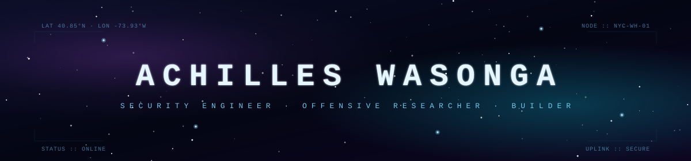

<!--
  ╔══════════════════════════════════════════════════════════════════╗
  ║  ACHILLES WASONGA · GitHub Profile README                        ║
  ║  Theme: deep-space telemetry / mission control                   ║
  ║  Edit any TODO marked section to taste.                          ║
  ╚══════════════════════════════════════════════════════════════════╝
-->

<p align="center">
  
</p>

<p align="center">
  <a href="https://github.com/AchillesWasonga">
    
  </a>
</p>

<p align="center">
  
  
</p>

<p align="center"></p>

<h2 align="center">▾ TRANSMISSION_01 :: IDENTITY</h2>

```bash
> whoami

  name        Achilles Wasonga
  role        Security Engineer (NYC)
  origin      Nairobi   →   Princeton   →   New York
  build       Princeton CS · full-stack · cyber security . cloud . AR
  focus       offensive security · cloud . CAD/AI tooling · LLM eval
```

<p align="center"></p>

<h2 align="center">▾ TRANSMISSION_02 :: ARSENAL</h2>

<p align="center">
  
</p>

<p align="center">
  <code>security ::</code>
  
  
  
  
  
  
</p>

<p align="center"></p>

<h2 align="center">▾ TRANSMISSION_03 :: TELEMETRY</h2>

<p align="center">
  
  
</p>

<p align="center">
  
</p>

<p align="center"></p>

<h2 align="center">▾ TRANSMISSION_05 :: COMMS</h2>

<p align="center">
  <a href="https://github.com/AchillesWasonga">
    
  </a>
  <a href="https://www.linkedin.com/in/allan-wasonga-2b31252bb/">
    
  </a>
  <a href="mailto:auwasonga@gmail.com">
    
  </a>
</p>

<p align="center">
  <sub><code>// end transmission · uplink stable · 2026</code></sub>
</p>
